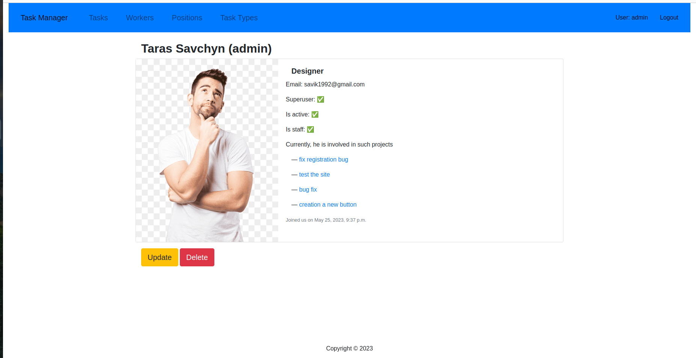
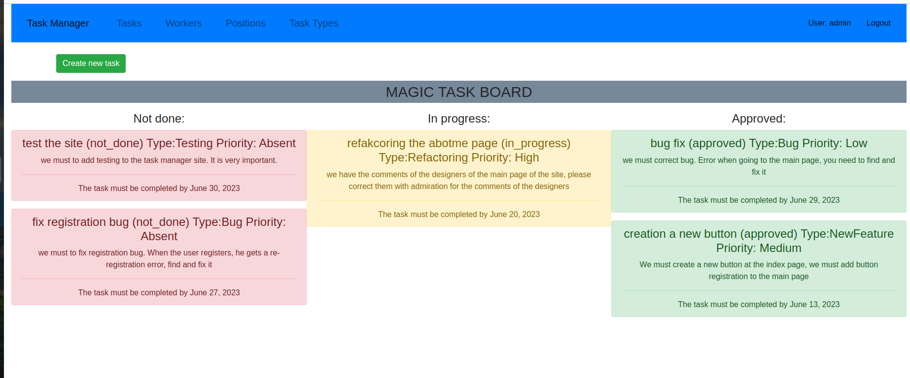
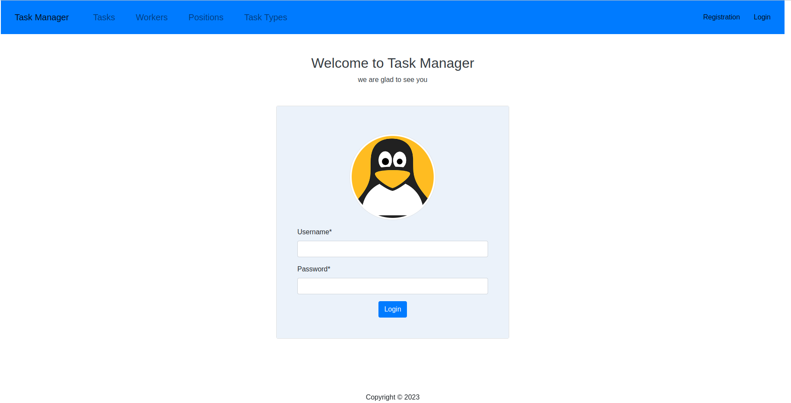

# IT_Company_Task_Manager
https://task-manager-3ixm.onrender.com/

You can login with next credentials:
- username: test
- password: Test-123

Task Manager, which will handle all possible problems during product 
development in your team. Everyone from the team can create Task, 
assign responsibility for tasks, and mark the Task as done 
(of course, better before the deadlines).Only registered users can access the site.

## сontent
- [technology](#technology)
- [testing](#testing)
- [design](#design)
- [screenshoots](#screenshoots)
- [using](#using)
- [project developer](#project-developer)
- [the purpose of the project](#purpose)

## technology
- [Python](https://www.djangoproject.com/)
- [Django](https://www.djangoproject.com/)
- [Butstrap4](https://getbootstrap.com/docs/4.6/getting-started/introduction/)
- [Django-Crispy-Forms](https://django-crispy-forms.readthedocs.io/en/latest/install.html#installing-django-crispy-forms)
- [Django-Debug-Toolbar](https://django-debug-toolbar.readthedocs.io/en/latest/installation.html#process)
- [CSS](https://css.in.ua/)
- [HTML](https://html.com/)

## using

Then open your terminal and navigate to the directory you wish to store the project and run the following commands:

```sh
$ git clone https://github.com/TarasSavchyn/IT_Company_Task_Manager.git
```

Once you've cloned the repository, navigate into the repository.

Create a virtual environment and activate it using the following commands:

```sh
$ python3 -m venv venv
$ source venv/bin/activate
```


Once you've activated your virtual environment install your python packages by running:

```sh
$ pip install -r requirements.txt
```

Now let's migrate our django project:

```sh
$ python3 manage.py migrate
```

If there are no hitches here you should now be able to open your server by running:

```sh
$ python3 manage.py runserver
```

Go to the web browser and enter http://127.0.0.1:8000 to verify whether the application is running fine or not.

## testing

Unittest was used to test the project. To run the tests, execute:
```sh
$ python3 manage.py test 
```

## design
Bootstrap4, django-crispy-forms and CSS are used for graphic design. We received the following presentation:

## screenshoots

Worker-detail-page:



Task-list-page:



Login-page


## purpose
The goal of the project was to develop its own interpretation of the task manager for the company.

## project developer

- [Taras Savchyn](https://www.linkedin.com/in/%D1%82%D0%B0%D1%80%D0%B0%D1%81-%D1%81%D0%B0%D0%B2%D1%87%D0%B8%D0%BD-ba2705261/) — Back-End Developer
